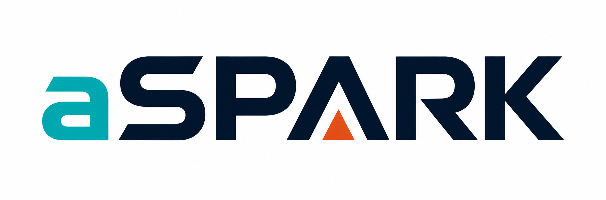
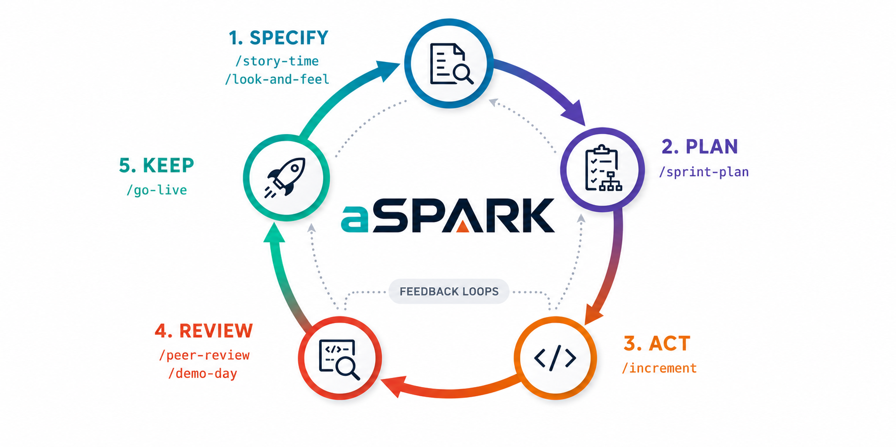

<div align="center">
  <picture>
    <source media="(prefers-color-scheme: dark)" srcset="assets/aspark-logo-dark.png" />
    
  </picture>
</div>

> **An agile AI product team for Claude Code.**
> One person plus aSPARK works like a whole team: a Product Owner who challenges your idea, a Designer who spots bad design, an Engineering Manager who locks the architecture, a Reviewer who finds your bugs, a QA Tester who clicks through your app in a real browser, and a Release Manager who ships it.

aSPARK turns Claude Code from a coding copilot into a **gated delivery process**. Every feature travels through five phases — **S**pecify, **P**lan, **A**ct, **R**eview, **K**eep — and may only move forward when the previous phase's quality gate is green.

---

## The SPARK Loop

<div align="center">
  <picture>
    <source media="(prefers-color-scheme: dark)" srcset="assets/aspark-loop-dark.png" />
    
  </picture>
</div>

| Phase | What happens | Gate to pass |
|---|---|---|
| **S**pecify | The idea is challenged, clarified against a coverage taxonomy, turned into user stories with acceptance criteria and non-functional requirements, and design-checked. | Spec approved: stories testable, NFRs measurable, ambiguity resolved, design risks named. |
| **P**lan | Architecture is decided, the work is cut into ordered tasks. | Plan approved: every task maps to a story, risks addressed. |
| **A**ct | The increment is built — strictly following the plan. | All planned tasks done, project builds and tests pass. |
| **R**eview | Code review by a senior eye, then hands-on QA in a real browser against the acceptance criteria. | No blocking findings, all acceptance criteria verified. |
| **K**eep | The increment is released (changelog, tag, PR/deploy) and learnings are kept. | Released and documented. |

---

## Meet the Team

| Command | Role | What they do |
|---|---|---|
| `/charter` | 📜 **Constitution** | Sets the project's standing principles and constraints once, in `constitution.md` — the ground rules every phase inherits. |
| `/story-time` | 🧭 **Product Owner** | Interrogates your idea with hard questions — no yes-man. Runs a Clarify pass, writes user stories, acceptance criteria and NFRs into `spec.md`. |
| `/look-and-feel` | 🎨 **Designer** | Detects bad design: usability heuristics, visual consistency, accessibility. Adds a design section to the spec. |
| `/sprint-plan` | 🏗️ **Engineering Manager** | Locks the architecture, makes the technical decisions, cuts the work into an ordered task breakdown in `plan.md`. |
| `/increment` | 💻 **Developer** | Builds a potentially shippable increment — strictly following the plan, no scope creep. |
| `/peer-review` | 🔍 **Reviewer** | Reviews the diff with a staff-engineer eye and writes findings into `review.md`. |
| `/demo-day` | 🧪 **QA Tester** | Clicks through the running app **in a real browser**, verifies every acceptance criterion, files bugs in `qa.md`. |
| `/go-live` | 🚀 **Release Manager** | Final checks, changelog, version tag, PR/deploy. Blocked while QA has open blockers. |
| `/spark` | 🤹 **Orchestrator** | Runs the whole loop end-to-end, enforcing every gate on the way. |

---

## How It Works

aSPARK keeps all decision artifacts **inside your project**, so the process is transparent and reviewable — just like a real team's ticket trail.

For each feature, a working directory is created:

```
your-project/
└── .spark/
    ├── constitution.md   ← written by /charter — project-wide, read by every phase
    └── <feature-name>/
        ├── spec.md       ← written by /story-time (+ /look-and-feel)
        ├── plan.md       ← written by /sprint-plan
        ├── review.md     ← written by /peer-review
        ├── qa.md         ← written by /demo-day
        └── release.md    ← written by /go-live
```

Each phase **reads the artifact of the previous phase** and refuses to start if the gate isn't met. Example: `/go-live` will not release while `qa.md` lists open blocking bugs — it sends you back to `/increment` instead. That's the whole point: the team doesn't just produce code, it makes sure **the product actually works**.

Requirements carry **stable IDs** (`US-`, `AC-`, `NFR-`) from the spec all the way through: the plan cites which AC each task covers, the review traces each Must AC to code, and QA verifies it under the same ID. Nothing silently falls out of the chain. The project-wide `constitution.md` (optional, set once via `/charter`) holds the principles and constraints every feature inherits, so they aren't re-argued each cycle.

---

## Installation

**Requirements:** [Claude Code](https://claude.com/claude-code) and Git. For `/demo-day` you additionally need a browser integration (Claude in Chrome, or a Playwright / Chrome DevTools MCP server).

### The easy way — inside an interactive Claude Code session (recommended)

Do this in a **normal** (interactive) `claude` terminal session, using the built-in `/plugin` command. Dummy-proof version:

**1. Open Claude Code** in your terminal:

```
claude
```

**2. Add the marketplace** (the "shop" where the plugin lives — you only ever do this once):

```
/plugin marketplace add a-lottes/aSPARK
```

**3. Install the plugin** — read it as `pluginname@marketplacename`:

```
/plugin install aspark@aspark
```

**4. Restart Claude Code** — close and reopen your session (or `/exit`, then `claude` again). Plugins only activate after a restart.

**5. Check it worked:**

```
/plugin
```

This opens a menu of your installed plugins — you should see **aspark** listed and enabled.

### The non-interactive way — from a plain terminal

The `/plugin` menu command only works in an interactive session. In scripts, CI, or a non-interactive shell, use the full CLI equivalents — they do exactly the same thing:

```bash
claude plugin marketplace add a-lottes/aSPARK
claude plugin install aspark@aspark
```

### Local development install

To hack on aSPARK itself, point Claude Code at a local clone:

```bash
git clone https://github.com/a-lottes/aSPARK.git
claude --plugin-dir /path/to/aSPARK
```

> **One-line takeaway:** in a normal terminal → `/plugin marketplace add a-lottes/aSPARK` → `/plugin install aspark@aspark` → restart. Done. ✅

---

## Usage

A typical feature, step by step:

```
You:     /story-time I want a dashboard where users see their weekly stats
Claude:  [PO challenges the idea, asks the hard questions, writes spec.md]

You:     /look-and-feel
Claude:  [Designer reviews the planned UI, flags design risks in spec.md]

You:     /sprint-plan
Claude:  [EM locks architecture, cuts tasks into plan.md]

You:     /increment
Claude:  [builds the increment, task by task, following plan.md]

You:     /peer-review
Claude:  [reviews the diff, writes findings, fixes what's obvious]

You:     /demo-day http://localhost:3000
Claude:  [clicks through the app in a real browser, checks every acceptance criterion]

You:     /go-live
Claude:  [changelog, tag, PR — only if all gates are green]
```

In a hurry? Run the whole loop with one command:

```
You:     /spark I want a dashboard where users see their weekly stats
```

`/spark` pauses at each gate and shows you the artifact before moving on — you stay the decision maker.

---

## How to Read This Toolbox

If you're new to Claude Code plugins, this is all there is to it:

- **`agents/`** — the team members. Each file defines one persona (a *subagent*): its mindset, its standards, and which tools it may use. Agents are the "who".
- **`skills/`** — the ceremonies. Each folder holds one slash command (`SKILL.md`): what to do, which agent to involve, which template to fill, and which gate to enforce. Skills are the "how".
- **`templates/`** — the artifacts. Blueprints for `constitution.md`, `spec.md`, `plan.md`, `review.md`, `qa.md` and `release.md`, each (bar the constitution) ending in an explicit gate checklist. Templates are the "what".
- **`docs/`** — deep-dives, starting with the workflow and gate hand-over rules.
- **`.claude-plugin/`** — plugin metadata so Claude Code can discover and install all of the above.

Reading order for newcomers: this README → `docs/workflow.md` → one template → one skill → one agent. After that you'll understand every file in the repo.

---

## Project Status

aSPARK v0.1.0 is feature-complete and has passed a full end-to-end dry run. This README always reflects the current state.

- [x] Repo scaffold, plugin manifest, license
- [x] README with concept, team and usage guide
- [x] Artifact templates (`templates/`) — constitution, spec, plan, review-report, qa-report, release-notes, each (bar the constitution) with its gate checklist
- [x] The six team agents (`agents/`) — product-owner, designer, engineering-manager, reviewer, qa-tester, release-manager
- [x] The eight ceremony skills (`skills/`) — charter, story-time, look-and-feel, sprint-plan, increment, peer-review, demo-day, go-live
- [x] Spec-driven core — project constitution (`/charter`), Specify-phase Clarify pass, non-functional requirements, and `US-`/`AC-`/`NFR-` traceability from spec through plan, review and QA
- [x] The `/spark` orchestrator — full loop with gate stops, resume support and feedback-loop escalation
- [x] Workflow deep-dive ([docs/workflow.md](docs/workflow.md)) — constitution, artifact chain, gate invariants, traceability, feedback loops, role boundaries
- [x] Plugin structure validated (`claude plugin validate` ✔, skill/agent naming consistent)
- [x] End-to-end test on a sample project — full loop run on a vanilla-JS `quick-todo` app: PO→Designer→EM→build→review→real-browser QA→release, all five gates enforced, shipped as `v0.1.0`

---

## License

[MIT](LICENSE) © 2026 Andreas Lottes
