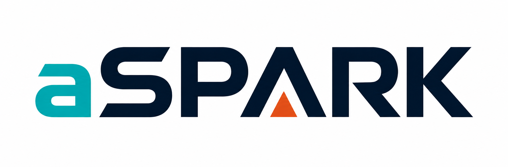
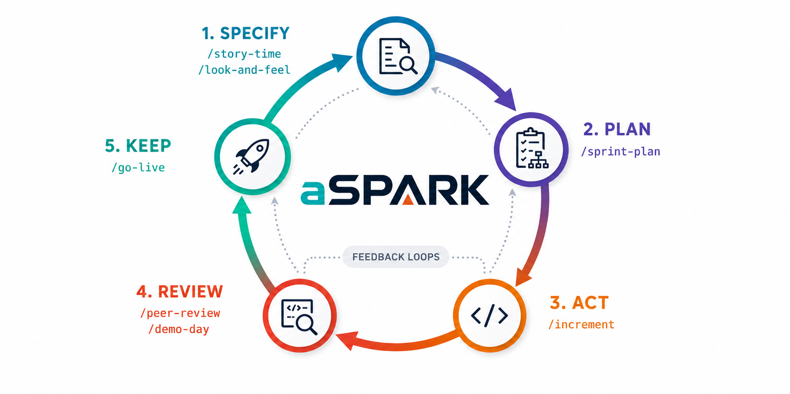

<div align="center">
  <picture>
    <source media="(prefers-color-scheme: dark)" srcset="assets/aspark-logo-dark.png" />
    
  </picture>
</div>

> **An agile AI product team for Claude Code.**
> One person plus aSPARK works like a whole team: a Product Owner who challenges your idea, a Designer who spots bad design, an Engineering Manager who locks the architecture, a Reviewer who finds your bugs, a QA Tester who clicks through your app in a real browser, and a Release Manager who ships it.

aSPARK turns Claude Code from a coding copilot into a **gated delivery process**. Every feature travels through five phases — **S**pecify, **P**lan, **A**ct, **R**eview, **K**eep — and may only move forward when the previous phase's quality gate is green.

---

## The SPARK Loop

<div align="center">
  <picture>
    <source media="(prefers-color-scheme: dark)" srcset="assets/aspark-loop-dark.png" />
    
  </picture>
</div>

| Phase | What happens | Gate to pass |
|---|---|---|
| **S**pecify | The idea is challenged, clarified against a coverage taxonomy, turned into user stories with acceptance criteria and non-functional requirements, and design-checked. | Spec approved: stories testable, NFRs measurable, ambiguity resolved, design risks named. |
| **P**lan | Architecture is decided, the work is cut into ordered tasks. | Plan approved: every task maps to a story, risks addressed. |
| **A**ct | The increment is built — strictly following the plan. | All planned tasks done, project builds and tests pass. |
| **R**eview | Code review by a senior eye, then hands-on QA in a real browser against the acceptance criteria. | No blocking findings, all acceptance criteria verified. |
| **K**eep | The increment is released — or, in a declared PR-mode project, handed off for approval — and learnings are kept. | Released (or handed off) and documented. |

---

## Meet the Team

| Command | Role | What they do |
|---|---|---|
| `/charter` | 📜 **Facilitator** | Grounds the project's standing principles and constraints in `constitution.md` — the ground rules every phase inherits, decided once. |
| `/next-steps` | 🧭 **Product Owner** | No idea in hand? Surveys shipped, in-flight and stalled work plus the constitution, and proposes one concrete next feature. Advisory only — nothing is written or approved. |
| `/story-time` | 🧭 **Product Owner** | Interrogates your idea with hard questions — no yes-man. Runs a Clarify pass, writes user stories, acceptance criteria and NFRs into `spec.md`. |
| `/look-and-feel` | 🎨 **Designer** | Detects bad design: usability heuristics, visual consistency, accessibility. Adds a design section to the spec. |
| `/sprint-plan` | 🏗️ **Engineering Manager** | Locks the architecture, makes the technical decisions, cuts the work into an ordered task breakdown in `plan.md`. |
| `/increment` | 💻 **Developer** | Builds a potentially shippable increment — strictly following the plan, no scope creep. |
| `/peer-review` | 🔍 **Reviewer** | Reviews the diff with a staff-engineer eye and writes findings into `review.md`. |
| `/demo-day` | 🧪 **QA Tester** | Clicks through the running app **in a real browser**, verifies every acceptance criterion, files bugs in `qa.md`. |
| `/go-live` | 🚀 **Release Manager** | Final checks, changelog, version tag, PR/deploy — or, in a declared PR-mode project, hands off for approval (`handed-off`). Blocked while QA has open blockers. |
| `/spark` | 🤹 **Orchestrator** | Runs the whole loop end-to-end, enforcing every gate on the way. |

---

## How It Works

aSPARK keeps all decision artifacts **inside your project**, so the process is transparent and reviewable — just like a real team's ticket trail.

For each feature, a working directory is created:

```
your-project/
└── .spark/
    ├── constitution.md   ← written by /charter — project-wide, read by every phase
    └── <feature-name>/
        ├── spec.md       ← written by /story-time (+ /look-and-feel)
        ├── plan.md       ← written by /sprint-plan
        ├── review.md     ← written by /peer-review
        ├── qa.md         ← written by /demo-day
        └── release.md    ← written by /go-live
```

Each phase **reads the artifact of the previous phase** and refuses to start if the gate isn't met. Example: `/go-live` will not release while `qa.md` lists open blocking bugs — it sends you back to `/increment` instead. That's the whole point: the team doesn't just produce code, it makes sure **the product actually works**.

Requirements carry **stable IDs** (`US-`, `AC-`, `NFR-`) from the spec all the way through: the plan cites which AC each task covers, the review traces each Must AC to code, and QA verifies it under the same ID. Nothing silently falls out of the chain. The project-wide `constitution.md` (optional, set once via `/charter`) holds the principles and constraints every feature inherits, so they aren't re-argued each cycle.

### The loop adapts to what you're building

Not every concern applies to every project. So aSPARK detects **what kind of software this is** and switches on the matching **lenses**: situational checklists that give the *existing* team extra things to check, only where they apply. Lenses activate two ways — from the project **type** and from its **characteristics** (what it does with data):

| Lens | Turns on for | What it adds |
|---|---|---|
| **seo** | a public `website` | Discoverability NFR, semantic structure, SSR + per-page metadata, Core Web Vitals in the browser |
| **ux** | an app-like `web-app` | Flow efficiency, every empty/loading/error state, forms, mobile |
| **api** | an `api` service | Error-envelope consistency, versioning & breaking-change detection, auth per endpoint |
| **cli** | a `cli` tool | Help clarity, stdout/stderr discipline, exit codes, safety flags |
| **library** | a `library` | Public API surface, semver/deprecation discipline, packaging & footprint |
| **security** | *handles auth · public · payments · PII* | Header hardening, auth lifecycle, the authz matrix, supply chain, PII/privacy — depth beyond the Reviewer's baseline |
| **i18n** | *multilingual* | Externalized strings, locale-aware formatting, text-expansion & RTL layout |
| **data** | *has a database* | Migration safety, integrity/transactions, indexing at scale, retention & recovery |

The Facilitator grounds the type and characteristics in the repo during `/charter` and the user confirms them. The constitution is the **single source of truth** — it's the only place a lens is switched on, so no phase can drift from another. Without a constitution, **no lens is applied**: each phase just gives a one-line nudge ("this looks like a `website` — run `/charter` to record it") and nothing more. When 4+ lenses come out active, the profile flags the elevated load — there's no cap, the visibility *is* the throttle.

A lens is **knowledge, not a new role** — the concern rides the same gates and the same `NFR-` traceability as everything else, so it's verified, never just asserted. Adding a new concern is a new file in [`lenses/`](lenses/), nothing more.

---

## Installation

**Requirements:** [Claude Code](https://claude.com/claude-code) and Git. For `/demo-day` you additionally need a browser integration (Claude in Chrome, or a Playwright / Chrome DevTools MCP server).

### The easy way — inside an interactive Claude Code session (recommended)

Do this in a **normal** (interactive) `claude` terminal session, using the built-in `/plugin` command. Dummy-proof version:

**1. Open Claude Code** in your terminal:

```
claude
```

**2. Add the marketplace** (the "shop" where the plugin lives — you only ever do this once):

```
/plugin marketplace add a-lottes/aSPARK
```

**3. Install the plugin** — read it as `pluginname@marketplacename`:

```
/plugin install aspark@aspark
```

**4. Restart Claude Code** — close and reopen your session (or `/exit`, then `claude` again). Plugins only activate after a restart.

**5. Check it worked:**

```
/plugin
```

This opens a menu of your installed plugins — you should see **aspark** listed and enabled.

### The non-interactive way — from a plain terminal

The `/plugin` menu command only works in an interactive session. In scripts, CI, or a non-interactive shell, use the full CLI equivalents — they do exactly the same thing:

```bash
claude plugin marketplace add a-lottes/aSPARK
claude plugin install aspark@aspark
```

### Local development install

To hack on aSPARK itself, point Claude Code at a local clone:

```bash
git clone https://github.com/a-lottes/aSPARK.git
claude --plugin-dir /path/to/aSPARK
```

> **One-line takeaway:** in a normal terminal → `/plugin marketplace add a-lottes/aSPARK` → `/plugin install aspark@aspark` → restart. Done. ✅

---

## Usage

No idea in hand? Let the Product Owner propose one from the project's current state:

```
You:     /next-steps
Claude:  [PO surveys shipped/in-flight/stalled work + constitution, proposes a feature]

You:     /story-time <the proposal you picked>
```

A typical feature, step by step:

```
You:     /story-time I want a dashboard where users see their weekly stats
Claude:  [PO challenges the idea, asks the hard questions, writes spec.md]

You:     /look-and-feel
Claude:  [Designer reviews the planned UI, flags design risks in spec.md]

You:     /sprint-plan
Claude:  [EM locks architecture, cuts tasks into plan.md]

You:     /increment
Claude:  [builds the increment, task by task, following plan.md]

You:     /peer-review
Claude:  [reviews the diff, writes findings, fixes what's obvious]

You:     /demo-day http://localhost:3000
Claude:  [clicks through the app in a real browser, checks every acceptance criterion]

You:     /go-live
Claude:  [changelog, tag, PR — only if all gates are green]
```

In a hurry? Run the whole loop with one command:

```
You:     /spark I want a dashboard where users see their weekly stats
```

`/spark` pauses at each gate and shows you the artifact before moving on — you stay the decision maker.

After a gate that followed heavy work — Act, QA, or any fix round — `/spark` also points out that you can `/clear` and pick the loop back up with `/spark`. The artifacts on disk *are* the state, so a fresh context resumes exactly where you stood, without carrying everything the last phase read and edited. It only ever offers; clearing is your call.

---

## How to Read This Toolbox

If you're new to Claude Code plugins, this is all there is to it:

- **`agents/`** — the team members. Each file defines one persona (a *subagent*): its mindset, its standards, and which tools it may use. Agents are the "who".
- **`skills/`** — the ceremonies. Each folder holds one slash command (`SKILL.md`): what to do, which agent to involve, which template to fill, and which gate to enforce. Skills are the "how".
- **`templates/`** — the artifacts. Blueprints for `constitution.md`, `spec.md`, `plan.md`, `review.md`, `qa.md` and `release.md`, each (bar the constitution) ending in an explicit gate checklist. Templates are the "what".
- **`lenses/`** — situational concern checklists (`seo`, `ux`, …). Activated by the project profile in the constitution and applied by the existing agents in the phases they own. Lenses are the "when it applies".
- **`tools/`** — guidance for optional external programs a ceremony may use *if you happen to have them installed*. Activated by installation state rather than by the constitution. Tools are the "if it's there".
- **`docs/`** — deep-dives, starting with the workflow and gate hand-over rules.
- **`.claude-plugin/`** — plugin metadata so Claude Code can discover and install all of the above.

Reading order for newcomers: this README → `docs/workflow.md` → one template → one skill → one agent. After that you'll understand every file in the repo.

---

## Optional Tools

Some ceremonies can go faster when an external program is available. They **never
require one.** If it isn't installed, the loop behaves exactly as it does
today — no error, no warning, no mention.

**[`aspark-graph`](https://github.com/a-lottes/aSPARK-graph)** — a deterministic
graph over your `.spark/` artifacts and source code. When present, `/sprint-plan`
uses it to ground *Affected Components*, `/peer-review` to scope a diff, and
`/demo-day` to scope a test plan. It is **optional** — published on PyPI as
`aspark-graph` (`pip install aspark-graph`, or `uvx aspark-graph build .` with no
install step at all) — and nothing in aSPARK installs, builds or runs it on your
behalf. A result from it is treated as a map, never a verdict: it says where to
look, and the agent still reads the code and still performs the steps.

See [`tools/README.md`](tools/README.md) for how this works and how to add another.

---

## Project Status

> **What's next** is in [ROADMAP.md](ROADMAP.md) — what ships next, what's blocked, and what was deliberately declined. This section is what exists *today*.

aSPARK is feature-complete — everything below ships today. The column that matters
is **how well each part is proven**, because prompt material has no test suite: the
only evidence is a documented run, written down. This section always reflects the
current state.

| Area | State |
|---|---|
| The loop — 10 skills, 7 agents, 6 templates, `/spark` | **Proven** — full end-to-end run on a sample app, all five gates enforced, shipped as `v0.1.0` |
| Spec-driven core — constitution, Clarify pass, NFRs, traceability | **Proven through Plan** — live review/QA traceability awaits a full `/increment` |
| Situational lenses (`lenses/`) | **Shipped, unproven in the field** — dogfooded on aSPARK itself, never yet run on someone else's project |
| Optional tools (`tools/`, `aspark-graph`) | **25 of 30 criteria proven live** pre-sweep, six shipped `partial`; a 2026-08-26 verify-only sweep closed three of those six live, refuted one with a finding, and left two out of scope (still `unproven`) — see below |
| PR-mode delivery (`handed-off`) | **Proven** on this repo's own release ([PR #3](https://github.com/a-lottes/aSPARK/pull/3)) |

**The one real gap:** the lens layer's success signal is a UI-lens QA-verified on a
real `website` **and** a Review-lens Review-verified on a real `api`. Neither has
happened yet. Lens compliance is instruction-driven — no test enforces that a lens
actually fired, and none can — so a report from a real project is the only evidence
that counts. If you run aSPARK on yours, [#4](https://github.com/a-lottes/aSPARK/issues/4)
and [#5](https://github.com/a-lottes/aSPARK/issues/5) are waiting for you.

**Post-sweep proof state for issues #8–#11** (verify-only sweep, 2026-08-26 —
**[.spark/graph-gates-verification/evidence.md](.spark/graph-gates-verification/evidence.md)**):
**proven** — [#9](https://github.com/a-lottes/aSPARK/issues/9) (`/demo-day`'s
no-browser stop path) and [#11](https://github.com/a-lottes/aSPARK/issues/11)
(the `aspark-graph build` hint fires exactly once; a stale graph is announced
once, then treated as absent) both held live, start to finish, with a stated
counting method. [#10](https://github.com/a-lottes/aSPARK/issues/10) (browser
backends) is now **proven** for Playwright MCP and Chrome DevTools MCP, one
real navigation-plus-assertion each; Claude in Chrome remains the only backend
proven in an actual project run. **Refuted-with-finding** —
[#8](https://github.com/a-lottes/aSPARK/issues/8) (MCP-first precedence): the
MCP branch is real and is taken when tools are exposed, but repeated fresh
sessions against an identical registered environment did not reliably
reproduce the documented zero-probe-command guarantee, and the sweep's own
evidence points at a specific fix: the tool file's "run no command" and the
ceremony skills' "resolve both facts" give the MCP branch no documented,
command-free way to satisfy both at once. **Unproven, out of this sweep's
scope** — AC-1.2 (byte-identical output vs. the pre-change version) and AC-5.2
(omitting a `files:` note for a genuinely unknowable-at-plan-time task): this
feature never attempted either; they remain exactly as unproven as before.
`docs/status.md`'s full criterion table predates this sweep and is not yet
reconciled with it — a follow-up, not part of this diff.

Full evidence — every run, every `partial` and why it ships that way:
**[docs/status.md](docs/status.md)**.

---

## License

[MIT](LICENSE) © 2026 Andreas Lottes
