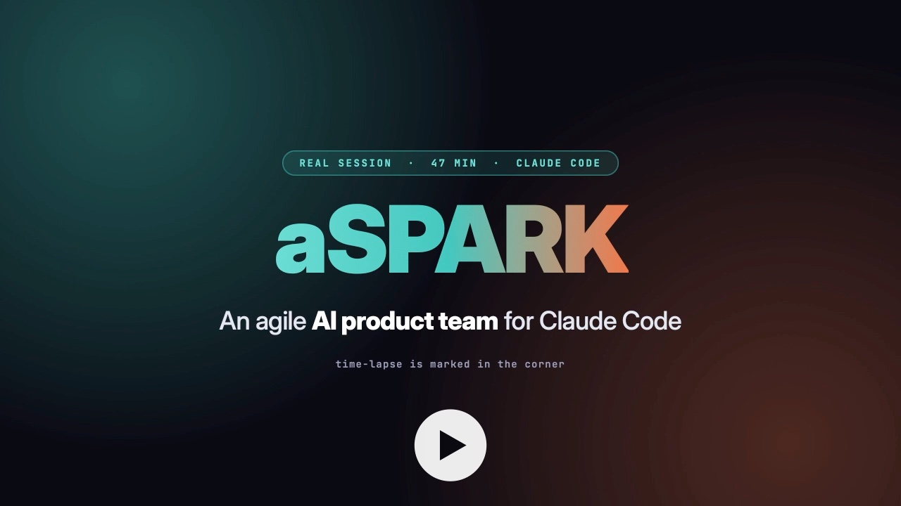

<div align="center">
  <picture>
    <source media="(prefers-color-scheme: dark)" srcset="assets/aspark-logo-dark.png" />
    
  </picture>
</div>

> **An agile AI product team for Claude Code.**
> You bring the idea. A Product Owner challenges it, an Engineering Manager plans it, the Developer builds it, a Reviewer audits the diff, a QA Tester clicks through your app **in a real browser**, and a Release Manager ships it — and nothing moves to the next phase until the previous gate is green.

aSPARK is a Claude Code plugin. No service, no account, no runtime: it is Markdown that installs into your project and leaves a reviewable paper trail in `.spark/`.

<div align="center">
  <a href="https://aspark.lottes.dev/en/#showcase">
    
  </a>
  <br />
  <sub><b>▶ Watch the 96-second demo</b> — one real 47-minute session, /spark to /go-live. Every time-lapse is marked.</sub>
</div>

---

## See it work

One command runs the whole loop. It stops at every gate and shows you the artifact before moving on — you stay the decision maker.

```
You:     /spark I want a dashboard where users see their weekly stats

Claude:  [Product Owner]  Challenges the idea, asks what "weekly" means for a user
                          in another timezone, writes spec.md with US-1…US-3 and
                          testable acceptance criteria. → Gate: you approve the spec.
         [Designer]       Flags an empty-state gap and a contrast risk in the spec.
         [Eng. Manager]   Decides the architecture, cuts 6 tasks into plan.md, each
                          mapped to a story. → Gate: you approve the plan.
         [Developer]      Builds task by task. No scope creep — the plan is the fence.
         [Reviewer]       Reads the diff, finds an off-by-one in the week boundary,
                          files F1 (Major) in review.md, fixes it, re-checks.
         [QA Tester]      Opens http://localhost:3000, verifies AC-1.1…AC-3.2 in the
                          browser, files a bug where the chart never loads on mobile.
                          → Gate: back to the Developer, then QA again.
         [Release Mgr]    Changelog, tag, PR. → Gate: your explicit go.
```

What lands in your repo:

```
.spark/
├── constitution.md         ← project-wide ground rules, set once with /charter
└── weekly-stats-dashboard/
    ├── spec.md             ← stories US-n, acceptance criteria AC-n.m, NFRs
    ├── plan.md             ← architecture decision, ordered tasks T1…Tn
    ├── review.md           ← findings F1…Fn with severity and location
    ├── qa.md               ← every AC and NFR verified, pass/fail, in the browser
    └── release.md          ← changelog, version, what was learned
```

Requirements carry stable IDs from the spec all the way through: the plan cites which AC each task covers, the review traces each Must AC to code, and QA verifies it under the same ID. Nothing silently falls out of the chain.

**Two real, complete examples you can read today:**

- [**steamcore**](https://github.com/a-lottes/steamcore) — an ESP32 arcade console built from scratch with aSPARK: 13 features, each with its full spec → plan → review → QA → release trail under [`.spark/`](https://github.com/a-lottes/steamcore/tree/main/.spark). Start with [`highscore-system`](https://github.com/a-lottes/steamcore/tree/main/.spark/highscore-system). It has no browser surface, so it also shows the declared substitute-QA path.
- [**this repository**](.spark/) — aSPARK is built with aSPARK; its own `.spark/` folder is the trail of a `library`-type project.

---

## Install

**Requirements:** [Claude Code](https://claude.com/claude-code) and Git. For `/demo-day` you also need a browser integration (Claude in Chrome, or a Playwright / Chrome DevTools MCP server), unless your project has no browser surface and `/charter` declares a substitute QA method.

Inside an interactive `claude` session:

```
/plugin marketplace add a-lottes/aSPARK
/plugin install aspark@aspark
```

Then restart Claude Code. `/plugin` should list **aspark** as enabled. From a plain shell or CI, the same two steps are `claude plugin marketplace add a-lottes/aSPARK` and `claude plugin install aspark@aspark`. To hack on aSPARK itself: `claude --plugin-dir /path/to/aSPARK`.

**Start here:** on a new project, empty or already full of code, run `/charter` first. On an empty repo it asks a handful of hard product questions and ends by offering `/story-time` with the first slice named. On an existing codebase it reads the repo and writes down what it found, for you to correct once. Either way the team stops re-deriving what your project *is* on every feature. You can skip it, but `/spark` and `/next-steps` will point you here first.

---

## The loop

Every feature travels through five phases — **S**pecify, **P**lan, **A**ct, **R**eview, **K**eep — and may only move forward when the previous phase's gate is green.

<div align="center">
  <picture>
    <source media="(prefers-color-scheme: dark)" srcset="assets/aspark-loop-dark.png" />
    
  </picture>
</div>

| Phase | What happens | Gate to pass |
|---|---|---|
| **S**pecify | The idea is challenged, clarified, turned into user stories with acceptance criteria and NFRs, and design-checked. | Spec approved by you. |
| **P**lan | Architecture decided, work cut into ordered tasks. | Plan approved by you; every task maps to a story. |
| **A**ct | The increment is built, strictly following the plan. | All tasks done, build and tests green. |
| **R**eview | Code review by a senior eye, then hands-on QA in a real browser. | No blocking findings, every AC verified. |
| **K**eep | Released, or handed off as a PR in a PR-mode project. Learnings recorded. | Released and documented. |

Review or QA findings go back to the Developer and the phase re-runs. After three failed rounds of the same phase the loop stops and asks you whether the plan or the spec is wrong, instead of grinding.

### The team

| Command | Role | What they do |
|---|---|---|
| `/charter` | 📜 Facilitator | Sets the project's standing principles and profile in `constitution.md`, once. |
| `/next-steps` | 🧭 Product Owner | No idea in hand? Surveys the project and proposes one concrete next feature. |
| `/story-time` | 🧭 Product Owner | Interrogates your idea, no yes-man. Writes stories, ACs and NFRs into `spec.md`. |
| `/look-and-feel` | 🎨 Designer | Usability heuristics, consistency, accessibility. Adds a design section to the spec. |
| `/sprint-plan` | 🏗️ Engineering Manager | Locks the architecture, cuts ordered tasks into `plan.md`. |
| `/increment` | 💻 Developer | Builds the increment following the plan. Also runs fix rounds. |
| `/peer-review` | 🔍 Reviewer | Reviews the diff with a staff-engineer eye, writes `review.md`. |
| `/demo-day` | 🧪 QA Tester | Clicks through the running app in a real browser, verifies every AC, writes `qa.md`. |
| `/go-live` | 🚀 Release Manager | Pre-flight, changelog, tag or PR. Refuses while QA has open blockers. |
| `/spark` | 🤹 Orchestrator | Runs the whole loop, or resumes a feature from wherever it stands. |

Each ceremony can also be run on its own. The artifacts on disk *are* the state, so you can `/clear` after a heavy phase and pick the loop back up with `/spark`.

### The loop adapts to what you're building

`/charter` records what kind of software this is (`website`, `web-app`, `api`, `cli`, `library`) and what it does with data (auth, payments, PII, database, multiple languages, accessibility mandate). That switches on matching **lenses**: extra checks the existing team applies only where they apply. A public website gets SEO and Core Web Vitals in QA. An API gets error-envelope and versioning checks in review. A project that handles payments gets the security lens through every phase. Nine lenses ship today; adding one is a new file in [`lenses/`](lenses/). Without a constitution, no lens fires.

---

## Project Status

**Proven on the author's projects. Not yet proven on someone else's.**

The loop has run end to end on sample apps and on this repository itself: as of the last count, 77 features across three machines, with 429 role-agent runs and 377 human gate decisions. Every figure is re-derivable from the committed reports in [`docs/reports/`](docs/reports/) with standard-library Python, see [`docs/metrics.md`](docs/metrics.md).

What is missing is a full loop on a real project that is not the author's. If you run aSPARK on anything real, [a field report](https://github.com/a-lottes/aSPARK/issues/new?template=field_report.yml) is worth more than a patch, especially when it went badly. Per-capability proof state, every `partial` and why: [`docs/status.md`](docs/status.md). What ships next: [`ROADMAP.md`](ROADMAP.md).

---

## Optional Tools

Core has no dependencies. Two optional companions hook into the loop if you install them; without them the loop behaves exactly as described above, no warning, no mention.

- [**aspark-guard**](https://github.com/a-lottes/aSPARK-guard) — enforces the gates in code, outside the model: denies a `.spark/` write that violates a phase precondition and records every write with its hash. `/plugin install aspark-guard@aspark`.
- [**aspark-graph**](https://github.com/a-lottes/aSPARK-graph) — a deterministic graph over your `.spark/` artifacts and code, used by `/sprint-plan`, `/peer-review` and `/demo-day` to scope work. `pip install aspark-graph`.

Two further siblings, `aspark-insights` and `aspark-policy`, do not touch the loop today. The whole family, with what each one's evidence does and does not cover: [`docs/family.md`](docs/family.md). Site: [aspark.lottes.dev](https://aspark.lottes.dev).

---

## Going deeper

- [`docs/workflow.md`](docs/workflow.md) — how artifacts hand over, what each gate checks, who may decide what.
- [`docs/repo-layout.md`](docs/repo-layout.md) — what `agents/`, `skills/`, `templates/`, `lenses/` and `tools/` are, and the reading order for newcomers.
- [`CONTRIBUTING.md`](CONTRIBUTING.md) — how to add a lens, skill or agent without breaking the contract.
- [`CLAUDE.md`](CLAUDE.md) — working habits kept across loops.

---

## License

[MIT](LICENSE) © 2026 Andreas Lottes
